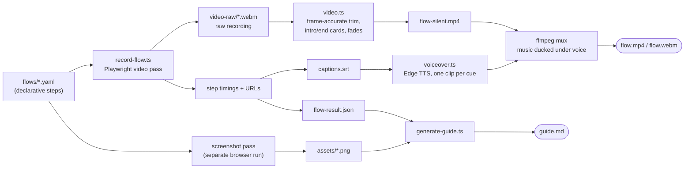
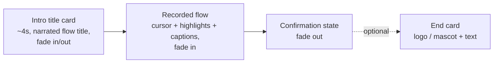
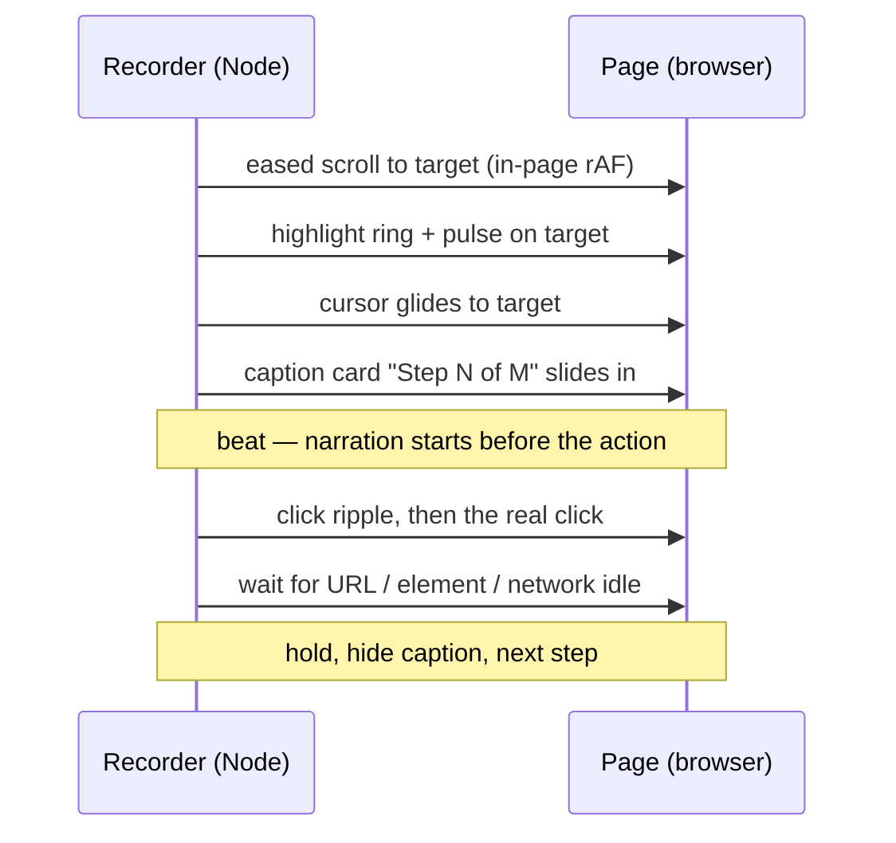
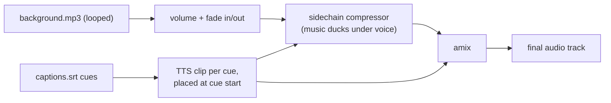

# Flow Documentation POC (Demo-as-Code)

Automated step-by-step guides **and narrated walkthrough videos** from declarative website navigation flows. Define a flow once in YAML, run one command, and get a markdown guide, annotated screenshots, and a polished MP4 — regenerable any time the UI changes. Pilot site: [grimme.com/en](https://grimme.com/en).

## Quick start

```bash
npm install
npx playwright install chromium
npm run demo
```

This runs the `contact-from-home` flow and writes everything under `output/contact-from-home/`:

| File | What it is |
|------|------------|
| `flow.mp4` / `flow.webm` | Polished walkthrough video — intro card, animated cursor, highlight rings, step captions, background music, AI voiceover |
| `guide.md` | User-facing markdown guide with numbered steps |
| `assets/*.png` | Guide screenshots |
| `captions.srt` | Step timings + copy (drives the voiceover; not burned into the video) |
| `flow-silent.mp4` | Silent master (trim + cards baked in) — input for audio remuxes |
| `flow-result.json` | Machine-readable recording metadata (steps, URLs, timings) |
| `video-raw/`, `voiceover-work/`, `debug/` | Intermediates (not published) |

> ⚠️ The pilot flow submits the **live** grimme.com contact form on every run.

## How it works



Flows are defined in YAML. Each step has an action, a human-readable title/description (used for captions, narration, and the guide), and optional behaviour flags. Edit the YAML, re-run `npm run demo`, and everything regenerates.

### Anatomy of the final video



Caption and voiceover timings are captured against the recording clock, then shifted automatically when the intro card is prepended — the narration always lands on the right step.

### What happens during one click step



For SPA hash navigations (e.g. `/service#contact`) the recorder pins the viewport to the top across the route change, so the browser's native anchor jump never appears on camera — the eased scroll is the only motion.

### Audio mix



Narration is never time-stretched: if a cue's speech outruns its slot, it fades out gently instead of speeding up. TTS-only pronunciation fixes (e.g. `GRIMME → Grimmer`) apply to the voice track only — captions and the guide keep the original spelling.

## Commands

| Command | Description |
|---------|-------------|
| `npm run record` | Record a flow YAML (default: `contact-from-home.yaml`) |
| `npm run record -- other-flow.yaml` | Record a different flow file from `flows/` |
| `npm run generate` | Build `guide.md` from `flow-result.json` |
| `npm run demo` | Record + generate in one step |
| `npm run music:remux` | Re-mix audio over the existing silent master (no re-record) |
| `npm run test:flow` | Playwright test with trace + video |

## Writing flows

### Step actions

| Action | Purpose |
|--------|---------|
| `goto` | Navigate to a URL |
| `click` | Click an element (cursor glide + ripple in the video) |
| `click_optional` | Click if present (e.g. cookie banners) |
| `fill` | Focus a field and type a value (visible keystrokes on video) |
| `scroll_to` | Smooth-scroll an element into view |
| `assert_visible` | Wait for an element, capture confirmation |

### Locator format

```yaml
locator:
  role: link        # getByRole
  name: Contact
  within:           # optional scoping
    role: dialog
```

Also supports `text:` and `css:` keys. See `src/locators.ts`.

### Useful step flags

| Flag | Effect |
|------|--------|
| `highlight: true` | Ring + glow + pulse on the target |
| `type_delay_ms` | Per-keystroke delay so typing is visible |
| `wait_for` | Wait for an element after the navigation/click (e.g. a success dialog) |
| `wait_for_url` | Wait for a URL pattern after a click |
| `scroll_after` | Smooth-scroll to an element after a click (e.g. form on the new page) |
| `scroll_duration_ms` / `scroll_block` | Scroll speed and target alignment |
| `wait_after_ms` | Extra hold after the action |
| `video_caption: false` / `screenshot: none` | Hide a step from the video / guide |

### Video options

```yaml
video:
  scroll_duration_ms: 3500     # base eased-scroll duration; scales with distance
  music: assets/music/background.mp3
  music_volume: 0.45           # without voiceover
  music_volume_with_voice: 0.08
  voiceover: true              # Edge TTS narration from captions.srt
  voice: en-GB-SoniaNeural
  voice_rate: "-4%"
  pronunciations:
    GRIMME: Grimmer            # voice track only
  highlight_color: "#F5C518"
  highlight_opacity: 0.16
  intro_card: true             # default; or { duration_ms, title, subtitle }
  # end_card:                  # optional closing card
  #   image: assets/logo.png
  #   heading: Thanks for watching
  #   text: grimme.com         # defaults to the site host
```

## Adding a new flow

1. Copy `flows/contact-from-home.yaml` to `flows/your-flow.yaml`.
2. Update `name`, `title`, `output_dir`, and `steps`.
3. Run `npm run record -- your-flow.yaml && npm run generate -- output/your-flow/flow-result.json`.

## Recording internals

Recording uses **two passes** so video polish and guide assets don't interfere:

1. **Video pass** — 1920×1080 (16:9), animated cursor, captions, eased scrolling; produces the recording and per-step timings.
2. **Screenshot pass** — a separate clean run for guide PNGs (including full-page captures where configured).

Implementation notes worth knowing before editing `src/`:

- **In-page animation everywhere.** Cursor glides, scrolls, and the form-settle correction run inside the browser on `requestAnimationFrame`. Driving animation from Node (one CDP evaluate per frame) visibly stutters.
- **Overlays mount post-hydration.** The pilot site is a hydrated React app: DOM injected before hydration is wiped by React's recovery render. All overlays (cursor, captions, highlights) are mounted idempotently via `evaluate` after the page is ready.
- **`page-shims.ts` is required.** tsx/esbuild's `keepNames` compiles named inner functions into `__name(...)` helper calls; Playwright serialises injected functions without that helper, so a no-op `window.__name` shim is installed as the first init script.
- **Trim is re-encoded.** Stream-copy trimming can only cut on keyframes, which leaked the cookie banner into the opening frames. The trim, fades, and card concat happen in a single ffmpeg encode (`crf 20`, `yuv420p`, `+faststart` on mp4).

See [docs/web-flow-documentation-research.md](docs/web-flow-documentation-research.md) for the full tooling landscape and the original plan.
