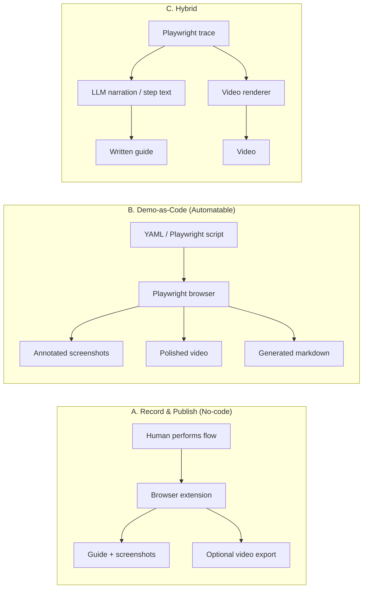

# Web Flow Documentation: Research & Plan

**Goal:** Automatically (or semi-automatically) create user-facing documentation that shows how to reach a feature on a website — e.g. *“How do I get to the Contact page from the home page?”* — with both **written step-by-step explainers** and **video walkthroughs**.

**Example flow:**

```
Home → click "Contact" in nav → Contact page loads → fill form → submit
```

This document compares existing tools, proposes composable architectures, and recommends a path based on how much automation vs. polish you need.

---

## What You're Really Building

Most solutions in this space produce one or more of these artifacts:

| Artifact | Best for | Typical format |
|----------|----------|----------------|
| **Step-by-step guide** | Help center, onboarding, support | Screenshots + numbered steps + short text |
| **Video walkthrough** | Demos, social, visual learners | MP4/WebM with cursor, zoom, narration |
| **Interactive demo** | In-app guidance, sales, self-serve tours | Clickable hotspots on captured UI |
| **Machine-readable flow** | CI, regression detection, regeneration | YAML/JSON of actions + selectors |

Your use case spans at least **guide + video**. The hardest part is not capturing once — it's **keeping docs current when the UI changes**.

---

## Three Approaches (High Level)



| Approach | Time to first doc | Automation | Stays fresh when UI changes | Best when |
|----------|-------------------|------------|-----------------------------|-----------|
| **A. No-code capture** | Hours | Low | Manual re-record | Small doc set, non-technical authors |
| **B. Demo-as-code** | Days–weeks setup | High | Re-run script in CI | You own the site, want versioned docs |
| **C. Hybrid** | Medium | Medium–high | Re-run + AI rewrites copy | Want polish + some automation |

---

## Category 1: No-Code / Low-Code Capture Tools

These tools watch a human perform a workflow and auto-generate guides. Fastest path to value; weakest on full automation.

### Scribe
- **What it does:** Chrome/desktop extension records clicks and navigation; auto-generates annotated screenshot guides.
- **Outputs:** Web-hosted guides, PDF, HTML, Markdown export; can combine guides into "Pages"; has a "movie" mode for video-like playback.
- **Strengths:** Very fast, great for internal SOPs and support teams, PII redaction (Smart Blur), enterprise governance.
- **Weaknesses:** No public API for programmatic generation; docs go stale when UI changes; video is secondary to static guides.
- **Fit:** Quick wins, manual or semi-manual doc creation at scale by non-engineers.

### Tango
- **What it does:** Similar capture model to Scribe; strong on **in-app guided walkthroughs** ("Guide Me") and workflow automation agents on higher tiers.
- **Outputs:** Step guides with screenshots, PDF/Markdown export, embedded walkthroughs inside your product.
- **Strengths:** Interactive in-product guidance (not just a separate doc); good for onboarding flows.
- **Weaknesses:** Same staleness problem; limited programmatic automation.
- **Fit:** You want users guided *inside* the app, not only in a help center article.

### Stepsy (free tier available)
- **What it does:** Lightweight Chrome extension; captures clicks → Google Doc with screenshots.
- **Outputs:** Google Docs (privacy-friendly — data stays in your browser/Drive).
- **Strengths:** Free, simple, no vendor lock-in for content storage.
- **Weaknesses:** No video pipeline; basic compared to Scribe/Tango.
- **Fit:** Bootstrap phase or internal docs with minimal budget.

### Guidde
- **What it does:** Screen recording → AI-generated narrated video with step chapters.
- **Outputs:** Video-first walkthroughs with voiceover.
- **Strengths:** Fast video production; good for onboarding/training.
- **Weaknesses:** Video-first (weaker written article output); narration tends to describe clicks rather than workflow intent.
- **Fit:** When video is the primary deliverable and speed matters more than CI integration.

**Verdict for no-code:** Excellent for **proving the format** and empowering PMs/support to create docs. Poor fit if you need **fully automated regeneration on every deploy**.

---

## Category 2: Interactive Demo Platforms

These skew toward **marketing/sales demos** but overlap with product documentation.

| Tool | Primary output | Notable features | Automation |
|------|----------------|------------------|------------|
| **Arcade** | Interactive demos + video + GIF from one capture | Record-first, brand AI, fast creation (~6 min claimed) | Low — re-capture on UI change |
| **Storylane** | HTML-based interactive tours | Branching, Buyer Hubs, CRM integrations | Low — build-first assembly |
| **Navattic** | HTML captures, lead forms | Sales workflow focus | Low |
| **Consensus** | Video + interactive actions combined | Sales enablement | Low |

**Verdict:** Great if docs double as **product marketing** or **sales leave-behinds**. Overkill if you only need help-center articles. None offer a robust "run in CI on every release" story.

---

## Category 3: Demo-as-Code (Fully Automatable)

This is the strongest category for **plug-together automation**. All of these use **Playwright** (or similar) to drive a real browser, which means flows can live in git, run in CI, and regenerate on deploy.

### Playwright (foundation)

Playwright is the common substrate. Key capabilities:

- **Codegen:** `npx playwright codegen <url>` — records actions and generates test/script code while you click.
- **Tracing:** Every action, screenshot, DOM snapshot, network call → `trace.zip`.
- **Trace CLI (new):** `npx playwright trace actions trace.zip` — machine-readable action list for agents/CI.
- **Screencast API:** Native video recording from browser sessions.
- **Trace exporter (in development):** `npx playwright export-trace` — Markdown + snapshots for LLM/debug workflows.

If you build a custom pipeline, Playwright is almost certainly the browser layer.

### Video-from-code tools

| Tool | Input | Output | Standout features |
|------|-------|--------|-------------------|
| **[ScreenCI](https://github.com/screenci/screenci)** | `.video.ts` (Playwright-style) | Polished MP4 + hosted delivery | Animated cursor, zoom, narration, `hide()` for setup steps |
| **[Demo Machine](https://github.com/45ck/demo-machine)** | `.demo.yaml` | MP4 + trace + quality report | MCP server for AI authoring, zoom/cursor overlays |
| **[NeuraScreen](https://github.com/NEURASCOPE/neurascreen)** | JSON scenario | MP4 + SRT subtitles + TTS voiceover | Multi-provider TTS, selector validator, GUI output browser |
| **[demotape](https://github.com/janfaris/demotape)** | JSON config | MP4/WebM, multi-format | Segment-based recording (no loading spinners), auth-aware, CI-friendly |
| **[testreel](https://github.com/greentfrapp/testreel)** | JSON or Playwright test fixture | WebM/MP4/GIF | Drop-in `recorded` test wrapper, window chrome styling |
| **[playwright-recast](https://github.com/ThePatriczek/playwright-recast)** | Existing `trace.zip` | Narrated video with zoom/highlights | Reuses test traces — no separate recording pass |

### Written-guide-from-code tools

| Tool | Input | Output | Standout features |
|------|-------|--------|-------------------|
| **[screenshot-annotator](https://github.com/arjunkai/screenshot-annotator)** | JSON spec per screenshot | Annotated PNGs (highlights, callouts, arrows) | Re-render all docs with one command when UI changes |
| **[playwright-specgen](https://github.com/trycatchkamal/playwright-specgen)** | `trace.zip` | `flows/*.yaml`, tests, API maps | Flow diffs in PRs — docs as living artifacts |
| **[playwright-trace-analyzer](https://github.com/iloveitaly/playwright-trace-analyzer)** | `trace.zip` | JSON/Markdown action reports | CLI-friendly, no browser UI needed |
| **Playwright MCP + LLM** | Natural language + browser | Markdown with embedded screenshots | Agent navigates site, highlights elements, writes copy |

**Verdict:** If "automatable" is a hard requirement, start here. The ecosystem is mature enough to **compose** rather than build from scratch.

---

## Category 4: AI-Assisted Hybrid Pipelines

Emerging pattern: **Playwright does the truth** (navigation, screenshots, video); **LLM does the prose** (step descriptions, summaries, alt text).

### Example workflow (documented in the wild)

1. Define target pages/flows (e.g. `flows/contact-from-home.yaml`).
2. Playwright MCP or a script navigates and captures screenshots at each step.
3. Inject CSS highlights on the active element before each screenshot.
4. LLM reads DOM context + screenshot → writes step text ("Click **Contact** in the top navigation bar").
5. Assembler writes Markdown/HTML and optionally feeds narration text to TTS for video.

**Pros:** Human-quality copy without manual writing; adaptable tone per audience.
**Cons:** LLM copy needs review; non-deterministic text unless you cache/approve per step.

---

## Recommended Composable Architectures

### Option 1 — "Fastest path" (1–2 days)

**Stack:** Scribe or Tango + optional Guidde for video

```
Author records flow once → Tool generates guide → Export to help center
```

- **Effort:** Minimal engineering
- **Automation:** None
- **When to use:** Validate doc format, <20 flows, UI changes infrequently

---

### Option 2 — "Balanced" (1–2 weeks)

**Stack:** Playwright codegen + screenshot-annotator + Markdown templates

```
                    ┌─────────────────────┐
  flow.yaml ───────►│ Playwright runner   │
  (or .spec.ts)     │  - navigate steps   │
                    │  - screenshot each  │
                    └────────┬────────────┘
                             │
              ┌──────────────┼──────────────┐
              ▼              ▼              ▼
     screenshot-annotator   trace.zip    (optional)
              │              │         playwright-recast
              ▼              ▼              ▼
         annotated PNGs   flow YAML      narrated MP4
              │           (specgen)
              ▼
        Markdown assembler
        (template + step text)
              ▼
         Published guide
```

**Example `flow.yaml` concept:**

```yaml
name: contact-from-home
start_url: https://example.com
steps:
  - action: goto
    url: /
    narration: "Start on the home page."
  - action: click
    selector: 'nav a[href="/contact"]'
    narration: "Click Contact in the main navigation."
  - action: assert_visible
    selector: 'h1:has-text("Contact Us")'
    narration: "You should now see the Contact page."
```

**Effort:** Moderate — one Playwright script + annotation specs + MD template
**Automation:** Run on demand or in CI on deploy
**When to use:** You own the product, want versioned docs, written guides are primary

---

### Option 3 — "Full pipeline" (2–4 weeks)

**Stack:** Demo Machine or ScreenCI + playwright-specgen + help center integration

```
flow definitions (git)
        │
        ▼
   CI on deploy ──────────────────────────────┐
        │                                     │
        ├─► Playwright records trace          │
        ├─► specgen → flows/*.yaml (diff)     │
        ├─► screenshot-annotator → PNGs       │
        ├─► Demo Machine → MP4 + narration    │
        └─► LLM → step descriptions (review)  │
                    │                         │
                    ▼                         ▼
              Help center API            CDN / video host
              (Intercom, Zendesk,       (Mux, Cloudflare
               GitBook, custom CMS)       Stream, S3)
```

**Effort:** Significant upfront; pays off at scale
**Automation:** Full — docs and videos regenerate on every release
**When to use:** Many flows, frequent UI changes, docs are a product surface

---

## Example: "Home → Contact Page" End to End

### Written guide output (target)

```markdown
# How to reach the Contact page

1. **Open the home page** — Go to https://example.com
   

2. **Click Contact** — In the top navigation bar, click **Contact**
   

3. **Confirm you're on the Contact page** — You should see the heading "Contact Us"
   
```

### Video output (target)

- 30–60 second MP4
- Animated cursor moves to nav → click ripple → page transition
- Optional AI voiceover synced to steps
- Optional burned-in step numbers or subtitles (SRT from NeuraScreen/Demo Machine)

### Minimal Playwright script (starting point)

```typescript
import { test, expect } from '@playwright/test';

test('document: home to contact', async ({ page }) => {
  await page.goto('https://example.com');
  await page.screenshot({ path: 'docs/assets/contact-from-home/step-01.png' });

  await page.getByRole('link', { name: 'Contact' }).click();
  await expect(page.getByRole('heading', { name: 'Contact Us' })).toBeVisible();
  await page.screenshot({ path: 'docs/assets/contact-from-home/step-02.png' });
});
```

Extend with `screenshot-annotator` specs to add highlight boxes, then wrap with `playwright-recast` or Demo Machine for video.

---

## Tool Comparison Matrix

| Tool | Written guide | Video | Interactive | API / CI | Staleness handling | Cost |
|------|:---:|:---:|:---:|:---:|:---:|------|
| Scribe | ✅ | ⚠️ | ❌ | ❌ | Manual re-record | Free tier + paid |
| Tango | ✅ | ⚠️ | ✅ | ❌ | Manual re-record | Free tier + paid |
| Stepsy | ✅ | ❌ | ❌ | ❌ | Manual re-record | Free |
| Guidde | ⚠️ | ✅ | ⚠️ | ❌ | Manual re-record | Paid |
| Arcade / Storylane | ⚠️ | ✅ | ✅ | ❌ | Re-capture | Paid ($$) |
| Playwright + annotator | ✅ | ⚠️ | ❌ | ✅ | Re-run script | Free (OSS) |
| Demo Machine / ScreenCI | ⚠️ | ✅ | ❌ | ✅ | Re-run script | OSS + optional hosted |
| playwright-recast | ❌ | ✅ | ❌ | ✅ | Re-run from trace | OSS |
| playwright-specgen | ✅ (YAML) | ❌ | ❌ | ✅ | Flow diff in PR | OSS |

---

## Key Design Decisions

### 1. Selectors vs. visual matching

- **Prefer role/text selectors** (`getByRole('link', { name: 'Contact' })`) — survives minor CSS changes better than XPath.
- **Avoid brittle CSS** (`div > div:nth-child(3)`) — breaks constantly.
- **Consider data-testid** on your own product for doc stability.

### 2. Auth and environment

Many flows require login. Plan for:
- Playwright `storageState` (saved cookies/session)
- Environment-specific base URLs (`staging` vs `prod`)
- Seed data / demo accounts for reproducible screenshots

### 3. Sensitive data

- Blur PII in screenshots (Scribe Smart Blur, or post-process with ImageMagick)
- Use demo/sandbox environments for doc generation
- Never generate docs against production customer data

### 4. Where docs live

| Destination | Integration approach |
|-------------|---------------------|
| **Git repo (Markdown)** | CI commits updated assets; simplest for eng teams |
| **GitBook / Mintlify / Docusaurus** | MDX in repo, auto-deploy on merge |
| **Intercom / Zendesk** | API upload articles + image hosting |
| **In-app help** | Embed Tango Guide Me, or custom component with your PNGs/video |

### 5. Human review loop

Even fully automated pipelines should have:
- PR review for changed screenshots (visual diff)
- Optional approval gate before publishing to production help center
- Stale-doc detection: fail CI if selectors break or flow YAML drifts

---

## Maintenance: The Real Problem

> Every screenshot goes stale the moment your product ships a UI change.

| Strategy | How it works |
|----------|--------------|
| **Manual re-record** | Scribe/Tango — fine for <20 docs |
| **Re-run on deploy** | Playwright scripts in CI — best for owned products |
| **Flow diff alerts** | playwright-specgen compares `flows/*.yaml` across releases |
| **Visual regression** | Percy/Chromatic on doc screenshots — catch unintended changes |
| **Selector health check** | NeuraScreen selector validator, or a nightly Playwright smoke |

---

## Recommendations by Stage

### Stage 0 — Validate (this week)
1. Pick one real flow (e.g. Home → Contact).
2. Record it manually in **Scribe** or **Tango**.
3. Export Markdown and share with users/stakeholders.
4. Decide if the format (screenshots + steps + optional video) is right.

### Stage 1 — Semi-automated (next 2 weeks)
1. Add **Playwright** to the project.
2. Use **codegen** to capture the flow as a script.
3. Add **screenshot-annotator** for highlighted step images.
4. Store flows + assets in git; run script manually when UI changes.

### Stage 2 — Fully automated (month 2+)
1. Add **Demo Machine** or **ScreenCI** for polished video from the same flow definitions.
2. Add **playwright-specgen** for flow YAML and PR diffs.
3. Wire CI: on deploy to staging → regenerate docs → open PR or publish to CMS.
4. Optional: LLM layer for step copy generation with human review.

---

## Suggested "Plug Together" Stack (Our Best Bet)

For a team that owns the website and wants **both written guides and video**, with a path to full automation:

| Layer | Tool | Role |
|-------|------|------|
| **Browser automation** | Playwright | Navigate, assert, trace, screenshot |
| **Annotated screenshots** | screenshot-annotator | Highlights, callouts, step numbers |
| **Written docs** | Markdown templates in repo | Version-controlled articles |
| **Video** | Demo Machine *or* playwright-recast | MP4 from same flow/trace |
| **Narration** | Demo Machine / NeuraScreen TTS | AI voiceover per step |
| **Flow registry** | playwright-specgen YAML | Machine-readable flow catalog |
| **CI** | GitHub Actions | Regenerate on deploy |
| **Publishing** | Docusaurus / Mintlify / CMS API | User-facing delivery |

**Optional accelerators:**
- **Scribe/Tango** for flows you can't easily automate (third-party sites, one-offs).
- **Tango Guide Me** if you want in-app interactive guidance alongside help articles.
- **Playwright MCP** if you want an AI agent to draft new flows from natural language.

---

## Open Questions to Resolve

Before building, answer these:

1. **How many flows** do you need in the first 6 months? (10 vs 500 changes the architecture.)
2. **Do you own the codebase** for the sites being documented? (Third-party sites limit automation.)
3. **Is video required** for every flow, or only high-value ones?
4. **Who authors docs** — engineers, PMs, support, or an agent?
5. **Where do docs publish** — in-repo, help center SaaS, in-app?
6. **How often does the UI change** — weekly deploys need CI regeneration; quarterly can be manual.
7. **Auth complexity** — public pages only, or logged-in multi-role flows?

---

## Next Steps

1. [ ] Pick one pilot flow (recommend: Home → Contact — simple, high value).
2. [ ] Run a 30-minute Scribe/Tango capture to validate output format with stakeholders.
3. [ ] Spike a Playwright script for the same flow + 3 annotated screenshots.
4. [ ] Evaluate Demo Machine vs ScreenCI with a 2-hour video generation spike.
5. [ ] Decide publishing target (Markdown in repo vs help center).
6. [ ] Document selector conventions for the product (`data-testid`, role-based locators).
7. [ ] Prototype CI job: `on deploy → regenerate pilot flow → open PR with diff`.

---

## References

- [Playwright Trace Viewer](https://playwright.dev/docs/trace-viewer)
- [Playwright Codegen](https://playwright.dev/docs/codegen)
- [ScreenCI](https://github.com/screenci/screenci) — Playwright-style video scripts
- [Demo Machine](https://github.com/45ck/demo-machine) — YAML → MP4 with MCP
- [NeuraScreen](https://github.com/NEURASCOPE/neurascreen) — JSON → narrated video
- [playwright-recast](https://github.com/ThePatriczek/playwright-recast) — trace → narrated video
- [screenshot-annotator](https://github.com/arjunkai/screenshot-annotator) — annotated screenshot specs
- [playwright-specgen](https://github.com/trycatchkamal/playwright-specgen) — trace → flow YAML + tests
- [Scribe](https://scribe.com) / [Tango](https://www.tango.ai) — no-code capture
- [Arcade](https://www.arcade.software) — interactive demos + video
